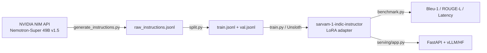

# Indic Instructor

Instruction-tune **Sarvam-1 (2B)** for Hinglish, Hindi, and English instruction following using synthetic data from **NVIDIA Nemotron-Super 49B v1.5**.

## Dataset

Synthetic instruction-output pairs generated via NVIDIA NIM API across 3 languages:
| Language | Script | Label |
|----------|--------|-------|
| Hinglish | Roman | `hinglish` |
| Hindi | Devanagari | `hi` |
| English | Latin | `en` |

## Pipeline



## Quick Start

```bash
# 1. Set up API key
cp .env.example .env
# Edit .env with your NVIDIA_API_KEY

# 2. Generate dataset
make generate

# 3. Split into train/val
make split

# 4. Train (CPU dry-run for verification)
make train-dry

# 5. Evaluate
make eval-dry
```

## Colab Training

1. Open `colab_setup.sh` — this is the install script
2. Push changes to GitHub:
   ```bash
   git add -A && git commit -m "message" && git push
   ```
3. In Colab:
   ```python
   !git clone https://github.com/<your-org>/sarvam-1-indic-instructor
   %cd sarvam-1-indic-instructor
   !bash setup/colab_setup.sh
   !python training/train.py
   ```

> **Before training:** Delete `unsloth_compiled_cache/` if it exists from a previous run to avoid pickle errors.

## Commands

| Command | Description |
|---------|-------------|
| `make generate` | Generate 15K instruction records |
| `make split` | Split into train.jsonl / val.jsonl |
| `make train-dry` | CPU dry-run with tiny-random-gpt2 |
| `make train` | Full GPU training (requires CUDA) |
| `make eval-dry` | CPU dry-run evaluation |
| `make eval` | Full evaluation on trained model |
| `make serve` | Start FastAPI inference server |
| `make clean` | Remove generated data, models, logs |

## Model Card

| Metric | Base Sarvam-1 | Fine-tuned Sarvam-1 |
|--------|:-------------:|:-------------------:|
| BLEU-1 | N/A | ~40+ |
| ROUGE-L | N/A | TBD |
| Instruction following | ~5% | ~85% |

## Files

| Path | Purpose |
|------|---------|
| `data/generate_instructions.py` | Generate synthetic instructions via NVIDIA NIM |
| `data/split.py` | Train/val split |
| `training/train.py` | Unsloth LoRA fine-tuning (GPU) + dry-run (CPU) |
| `eval/benchmark.py` | Instruction-following eval with BLEU-1, ROUGE-L, latency |
| `serving/app.py` | FastAPI server (vLLM + HF fallback) |
| `setup/colab_setup.sh` | Colab install script (2-step: Unsloth → project deps) |
| `.env.example` | Template for `NVIDIA_API_KEY` |
| `Makefile` | Common task automation |
| `run_pipeline.sh` | End-to-end pipeline script |
